# Sailboat IoT Telemetry Station


Autonomous, battery-powered telemetry unit for a sailboat. It monitors ambient
temperature, humidity, and bilge water level, and reports the readings over a
2G/GPRS cellular connection three times a day. The system is designed to run
for months on two 18650 Li-ion cells (in parallel) by spending nearly all of its time in
deep sleep, waking on a timer or immediately on a bilge water alert.

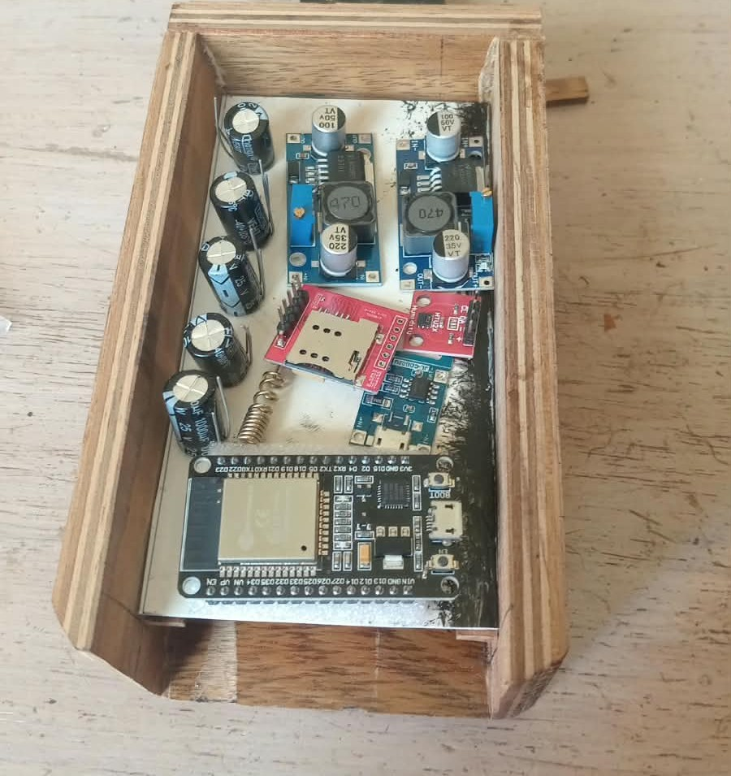


---

## Table of Contents

1. [Features](#features)
2. [Hardware Components](#hardware-components)
3. [Component Selection Rationale](#component-selection-rationale)
4. [Power Architecture](#power-architecture)
5. [Pin Mapping](#pin-mapping)
   - [HTU21D (I2C)](#htu21d-i2c)
   - [Bilge float switch (dry contact)](#bilge-float-switch-dry-contact)
   - [SIM800L (UART2)](#sim800l-uart2)
6. [Enclosure & Mechanical Design](#enclosure--mechanical-design)
   - [Cutting Plan & Panel Specifications](#cutting-plan--panel-specifications)
   - [Fabrication & Internal Tier Layout](#fabrication--internal-tier-layout)
7. [Assembly Progress](#assembly-progress)
8. [Firmware](#firmware)
9. [Development Environment Setup](#development-environment-setup)
10. [Progress Log](#progress-log)
11. [Acknowledgments](#acknowledgments)

---

## Features

- Temperature, humidity, and barometric context via I2C sensor
- Bilge water level monitoring via float switch, with hardware interrupt for
  immediate wake-up on flooding, independent of the sleep timer
- Cellular data reporting (2G/GPRS) three times a day, minimizing radio-on time
- Deep sleep power management: dual wake source (timer + external interrupt)
- Fully self-powered: two 18650 Li-ion cells (in parallel), no connection to the boat's
  electrical system
- Designed for a marine environment: sealed/vented enclosure, waterproof cable
  entries, corrosion-aware sensor placement

---

## Hardware Components

| Component | Role | Datasheet | Photo |
|---|---|---|---|
| ESP32 NodeMCU-32S (38-pin, CP2102) | Main controller | *add link* | 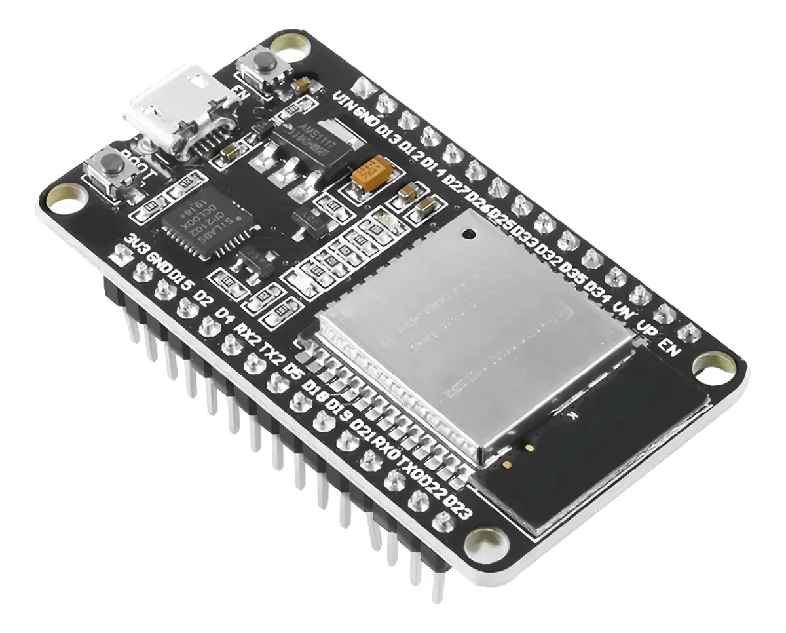 |
| HTU21D | Temperature & humidity sensor (I2C) | *add link* | 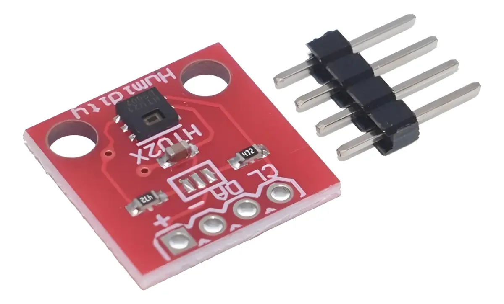 |
| SIM800L | 2G/GPRS cellular module | *add link* |  |
| Float switch 6017-1P (dry contact) | Bilge water level sensor | *add link* | 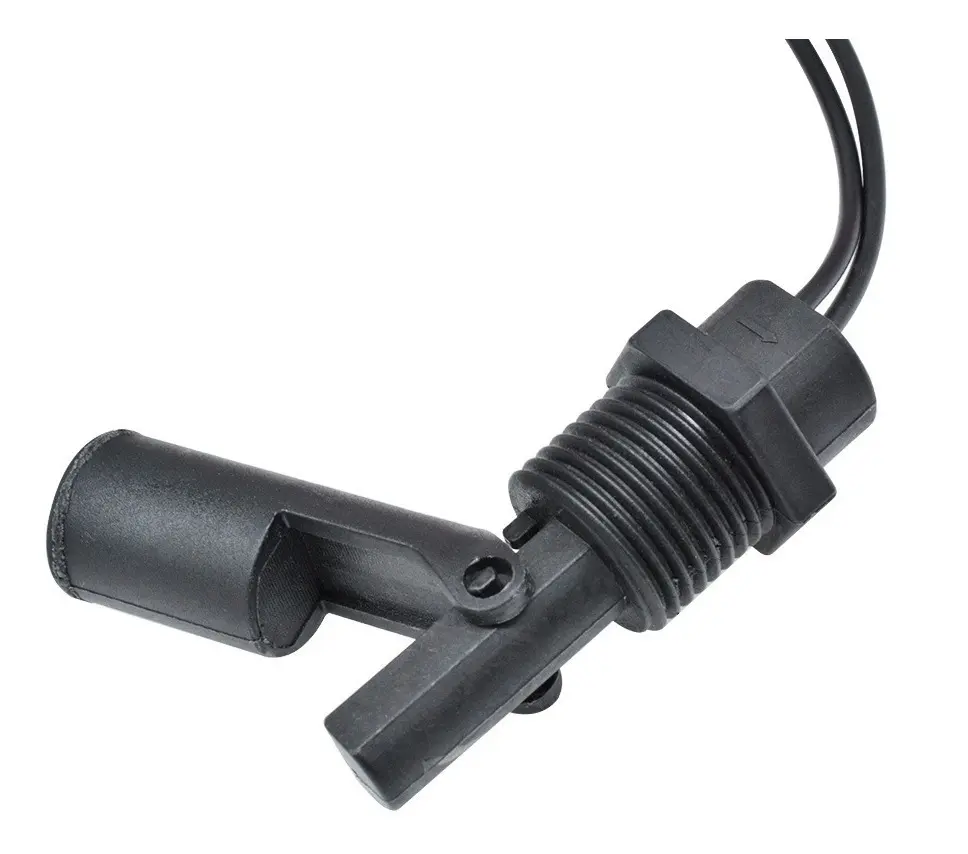 |
| TP4056 | Li-ion charging module | *add link* | 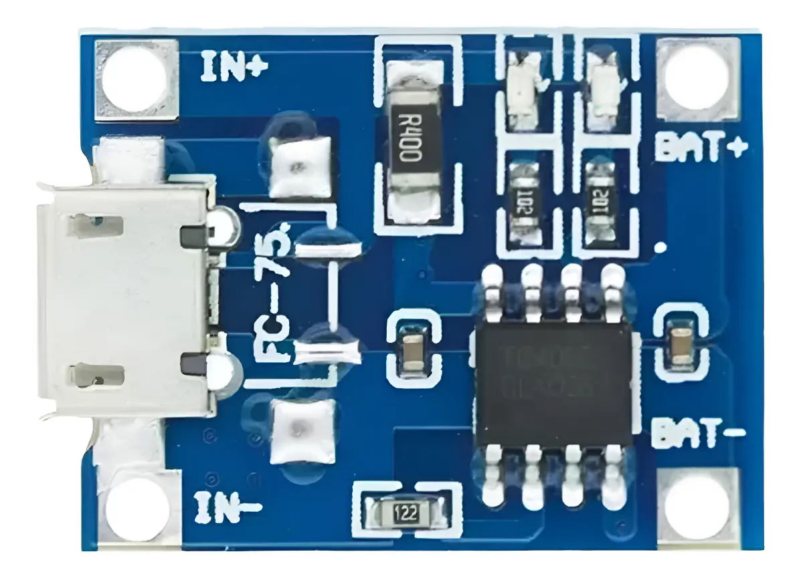 |
| XL6009 | Adjustable DC-DC step-up (boost) | *add link* | 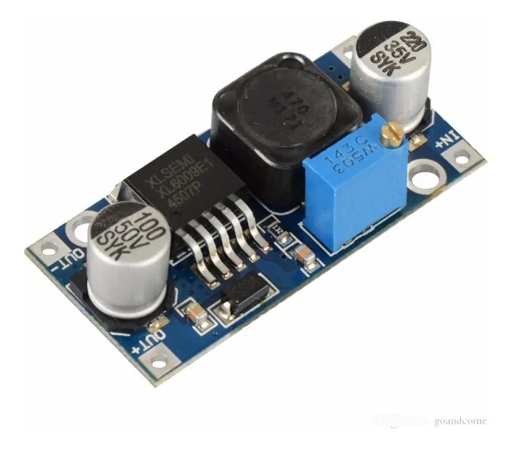 |
| LM2596 | Adjustable DC-DC step-down (buck) | *add link* | 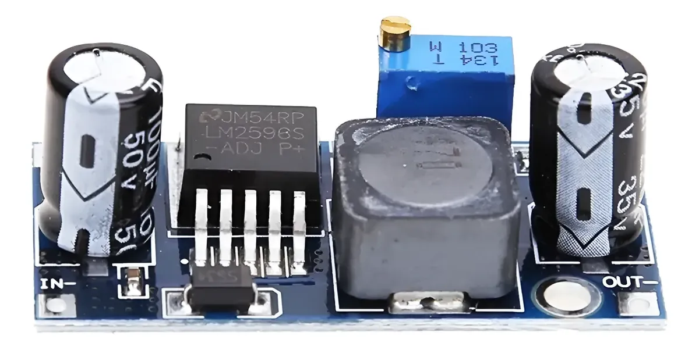 |
| 2x 18650 Li-ion cells (parallel) | Main power source | *add link* | 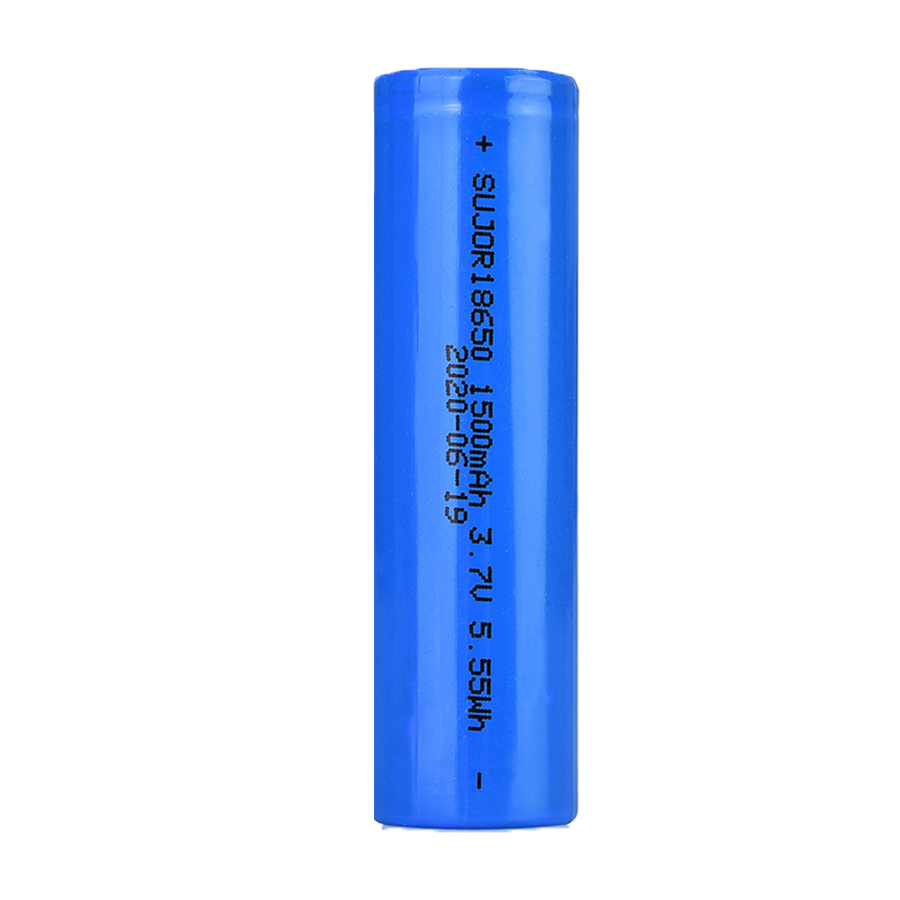 |
| 1000µF 25V electrolytic capacitor | Absorbs SIM800L current spikes | *add link* | 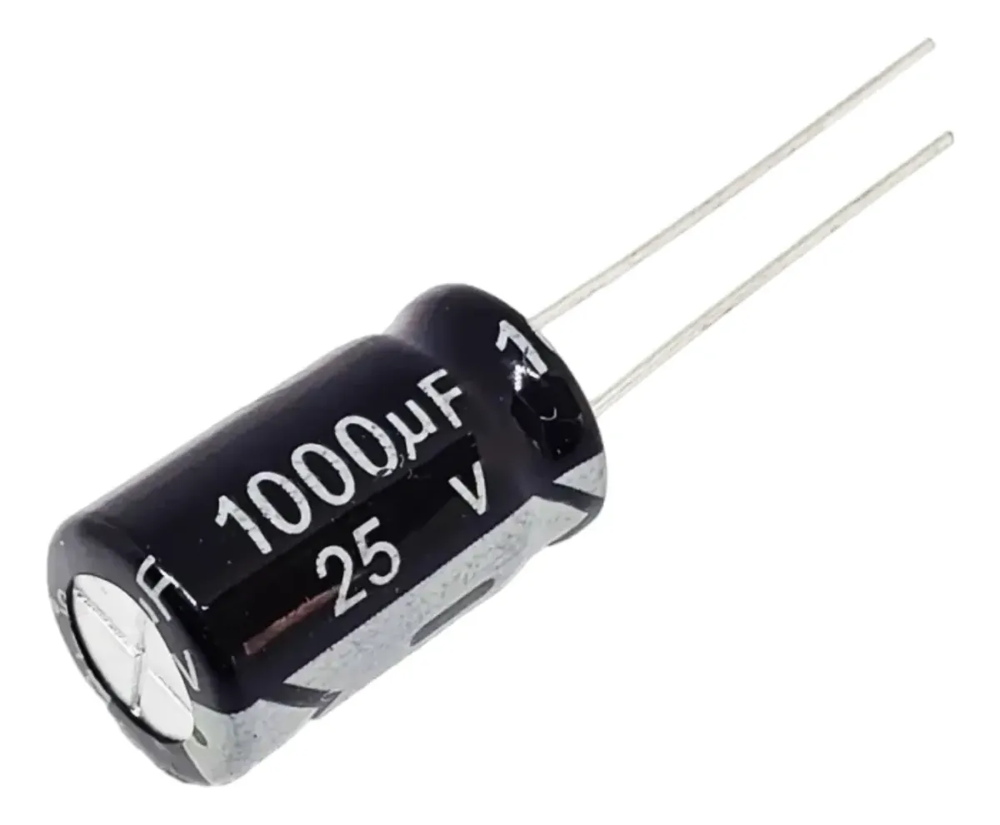 |
| 10kΩ / 20kΩ resistors | UART voltage divider + pull-up | *add link* | 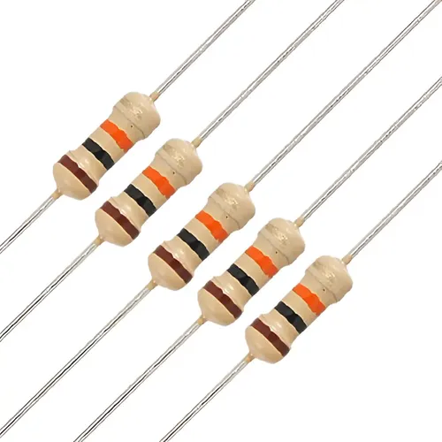 |

---

## Component Selection Rationale

**ESP32 (NodeMCU-32S) over Arduino or Raspberry Pi Zero.** Native deep sleep
with timer and external-interrupt wake sources, low active-mode power draw,
two hardware UARTs (needed for the SIM800L), 3.3V logic matching the sensors,
and enough RAM/flash to handle AT-command parsing and JSON payload assembly
without the overhead of a full Linux boot each cycle. A Raspberry Pi Zero,
while capable of the same task in software, has no real hardware-level power-off
between cycles and adds unnecessary boot latency for a job this small.

**HTU21D over BME280 / DHT22.** BME280/BMP280 lookalikes are commonly
mislabeled by resellers, and BMP280 specifically drops humidity entirely.
HTU21D shares the same I2C bus as the rest of the system (no extra GPIO/pull-up
needed like the 1-wire DHT22), and offers ±2% RH accuracy, adequate for a
weather-station use case.

**SIM800L (2G/GPRS) over a 4G module.** At the time of purchase, 2G networks
were still active in Argentina with no public shutdown date announced. The
data payload per transmission is tiny (a few sensor readings, 3 times a day),
well within GPRS bandwidth. A 4G-capable module (e.g. SIM7600/A7670) would have
been 5-10x more expensive for no practical benefit at this data volume.

**Float switch (dry contact) over a capacitive/resistive water sensor.**
Dry contact float switches are the marine-industry standard (same principle
used in automatic bilge pumps), with no exposed electronics in contact with
water, and no corrosion-prone traces like the cheap resistive water sensor
boards common in hobbyist kits.

**Boost (XL6009) + buck (LM2596) chain over a single regulator.** A 1S Li-ion
battery supply (3.0-4.2V from two parallel cells) cannot directly supply a
stable 4.0V for the SIM800L across its full discharge range, and the LM2596 buck
regulator requires at least ~1.5V of headroom between input and output to
regulate correctly. The chain steps the battery voltage up to a fixed ~6.0V first
(XL6009), then down to a clean 4.0V for the SIM800L (LM2596) — giving comfortable
headroom at every stage regardless of the battery's charge state.

**Two parallel 18650 cells (1S2P) over cells in series.** Two cells in series
(2S) would require a balancing BMS to charge safely, which the simple TP4056
charger does not provide. Wiring two 18650 cells in parallel doubles the battery
capacity while staying at a nominal 3.7V (1S configuration, 3.0-4.2V range), keeping
the charging circuit simple (plain TP4056) and extending autonomy to several
months given the system's mostly-sleeping duty cycle.

---

## Power Architecture

```
2x 18650 Li-ion cells in parallel (1S2P, 3.0V - 4.2V)
        |
        v
   TP4056 (charge/protection, B+/B-)
        |
        v (OUT+/OUT-)
   XL6009 step-up  --> trimmed to a fixed 6.0V
        |
        +---------------------------+
        |                           |
        v                           v
  ESP32 VIN (6.0V,               LM2596 step-down --> trimmed to 4.0V
  internal AMS1117                    |
  regulates to 3.3V)                  v
                              SIM800L VCC/GND
                              (+ 1000uF cap in parallel
                               at the module's pins)
```

All modules share a common ground.

---

## Pin Mapping

### HTU21D (I2C)
| HTU21D pin | ESP32 pin |
|---|---|
| VIN | 3V3 |
| GND | GND |
| DA (SDA) | GPIO 21 |
| CL (SCL) | GPIO 22 |

### Bilge float switch (dry contact)
| Wire | ESP32 pin |
|---|---|
| Wire 1 | GND |
| Wire 2 | GPIO 33 (RTC GPIO, internal pull-up enabled in firmware) |

### SIM800L (UART2)
| SIM800L pin | Connection |
|---|---|
| VCC | LM2596 output (4.0V) + capacitor positive lead |
| GND | LM2596 GND + capacitor negative lead + common ground |
| TXD | ESP32 GPIO 16 (RX2) — direct connection |
| RXD | ESP32 GPIO 17 (TX2) through a voltage divider (10kΩ series + 20kΩ to GND) to bring 3.3V logic down to ~2.2V |

---

## Enclosure & Mechanical Design

The unit is housed in a custom enclosure constructed from 9mm marine-grade plywood (150 mm × 100 mm × 60 mm external dimensions). To maximize moisture protection, avoid component crowding, and keep the electronics serviceable without disturbing the wiring, the enclosure is built around a **removable component tray**:

- **Removable Tray (Component Card):** A single rectangular board that slides into a slot running through the middle of the box. Every module — TP4056 charger, XL6009 boost, LM2596 buck, and the ESP32 — is glued directly to this tray in a fixed layout, with all inter-module wiring soldered on the tray itself. Because the whole assembly is on one card, the entire electronics stack can be slid out of the box as a single unit for inspection or repair, without unsoldering anything from the box itself.
- **Sealing & Pass-throughs:**
  - **Front Panel:** Ø12.5 mm hole fitted with an IP68 cable gland for the bilge float switch cable.
  - **Back Panel:** Ø12.5 mm hole (plugged/reserved for auxiliary external sensors).
  - **Left Panel:** 10 mm × 6 mm cutout providing direct access to the TP4056 Micro-USB charging port without opening the box.
  - **Right Panel:** Ø4 mm hole for the SIM800L external antenna feed.
  - **Removable Lid:** Fastened with four corner screws (Ø4 mm) and sealed with a perimeter rubber gasket against salt spray. The lid also has a dedicated **slot that exposes the ESP32's header pins**, so the external HTU21D temperature/humidity sensor can be wired and mounted outside the sealed box (where it can actually read ambient air) while its four wires (VIN, GND, SDA, SCL) pass through this slot to reach the tray inside.

### Cutting Plan & Panel Specifications

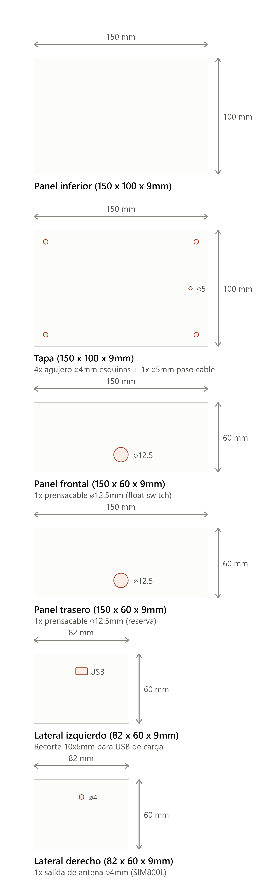

*Panel cutting dimensions, screw patterns, and pass-through positions for 9mm plywood.*

### Fabrication & Internal Tier Layout

| Lower Tier: Battery Bay | Upper Tier: Electronics Tray |
| :---: | :---: |
| 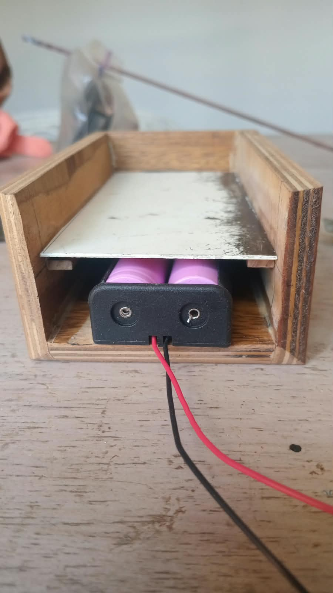 | 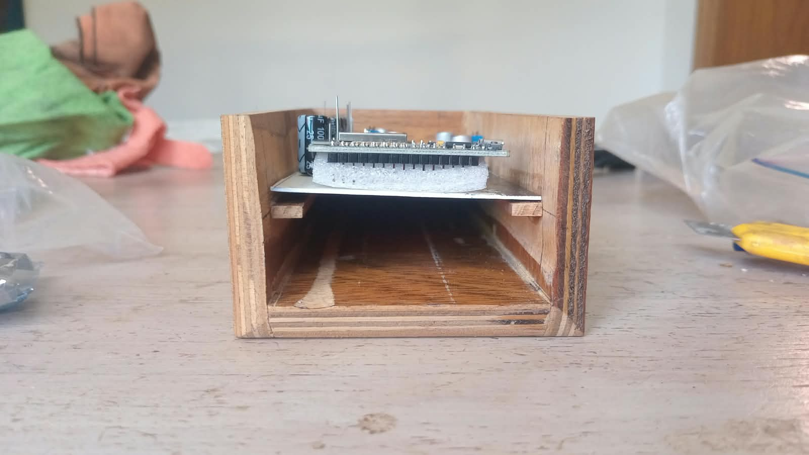 |
| *Battery compartment under the divider plate.* | *Removable tray mounting the ESP32 and power circuitry.* |

---

## Assembly Progress

Step-by-step build of the component tray and enclosure:

| 1. Tray layout & mounting holes | 2. Power chain wired | 3. ESP32 mounted |
| :---: | :---: | :---: |
| 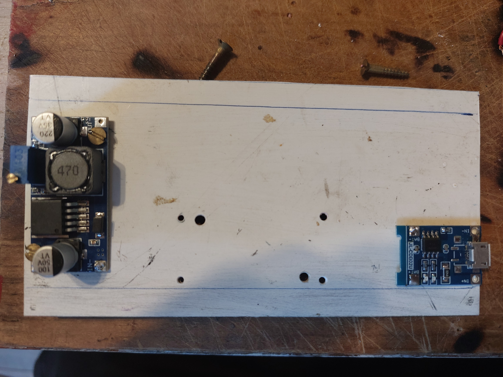 | 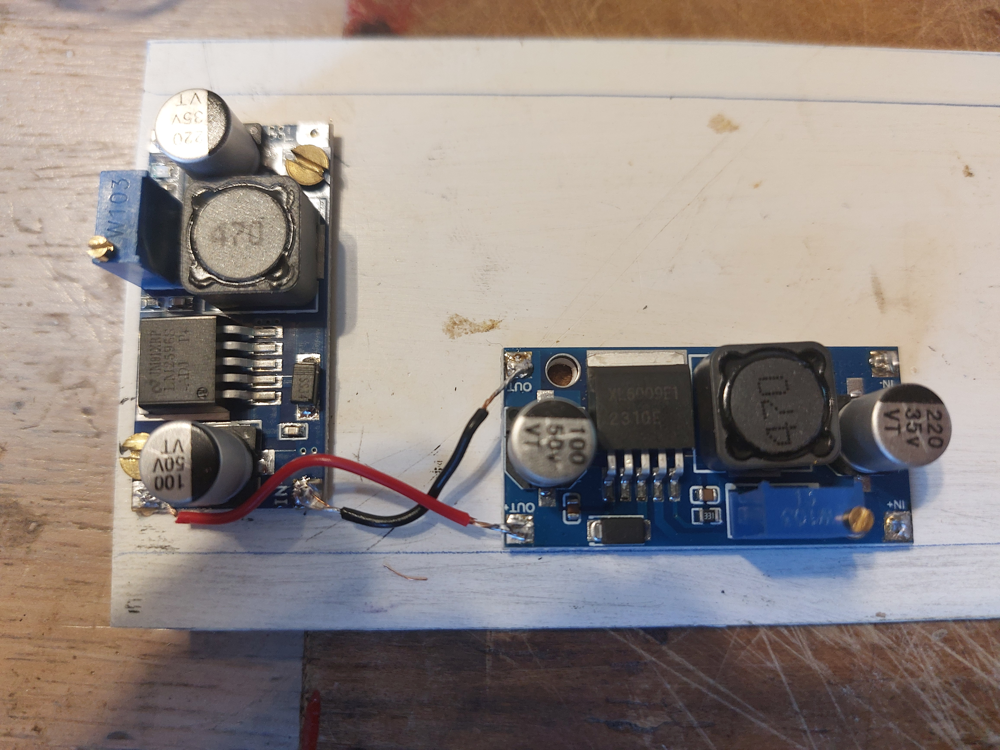 | 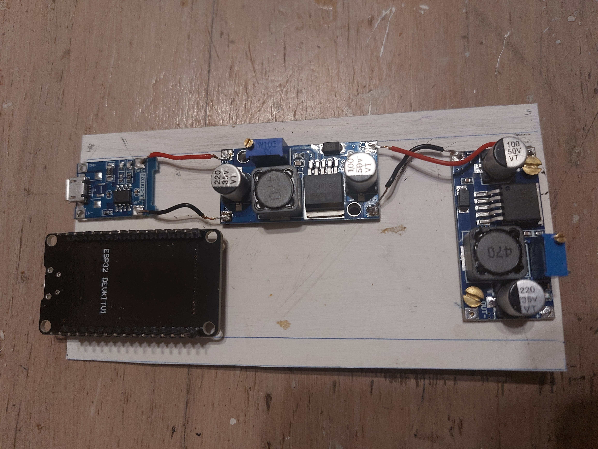 |
| *Mounting holes drilled and modules dry-fitted before gluing.* | *TP4056 charger wired into the XL6009 boost converter, which feeds the LM2596 buck converter above it.* | *ESP32 glued onto the tray alongside the completed charge/boost/buck chain.* |
| **4. Lid header slots cut** | **5. External sensor wired** | |
| 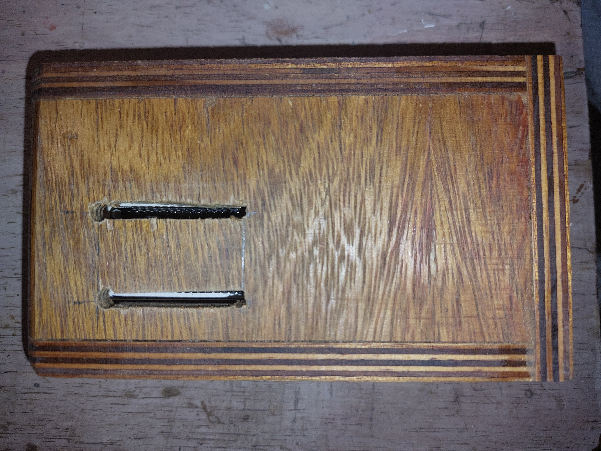 | 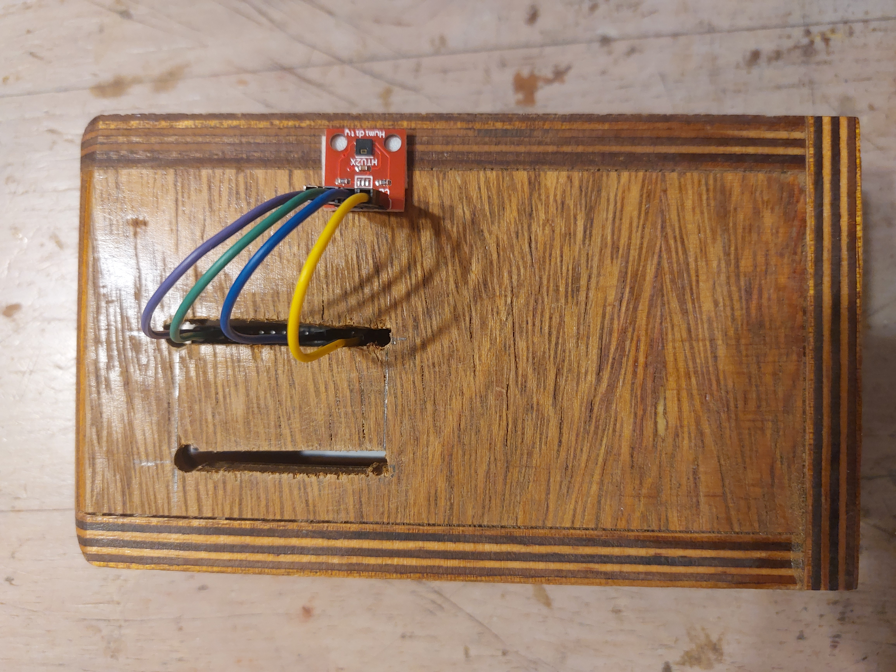 | |
| *Dual parallel slots cut through the enclosure lid directly aligning with the ESP32 pin headers to allow jumper wire routing.* | *HTU21D temperature & humidity sensor fixed to the exterior lid and wired via 4-conductor I2C jumper (3V3, GND, SDA, SCL).* | |

**Mounted and wired so far:**
- TP4056 charging module
- XL6009 step-up (boost) converter
- LM2596 step-down (buck) converter
- ESP32 NodeMCU-32S
- Enclosure lid with ESP32 header pass-through slots
- HTU21D sensor mounted externally on the lid and wired to ESP32 header pins

**Still to be completed:**
- SIM800L module placement and soldering (+ 1000µF buffer capacitor and UART voltage divider resistors)
- Bilge float switch wiring routed and sealed through the front panel IP68 cable gland
- Battery tray leads connection to TP4056 B+/B- inputs

---

## Firmware

Current test sketch: [`ESP32-Script.cpp`](/ESP32-Script.cpp)

What it currently does:
- Prints the deep sleep wake-up reason (timer vs. external interrupt) over serial
- Initializes I2C and attempts to read the HTU21D
- Reads the bilge float switch state
- Re-arms both wake sources (timer + EXT0) and re-enters deep sleep

Libraries used:
- [Adafruit HTU21DF Library](https://github.com/adafruit/Adafruit_HTU21DF_Library)

Not yet implemented in firmware:
- SIM800L AT command handling
- Cellular data transmission / payload formatting
- Production sleep interval (currently 30 seconds for bench testing, will be
  changed to match the 3x/day schedule)

---

## Development Environment Setup

1. **Arduino IDE** — [Download](https://www.arduino.cc/en/software/)
   Install the ESP32 board package from Espressif Systems via
   *Boards Manager* inside the IDE.

2. **CP210x USB-to-UART driver** (Silicon Labs) — required for the
   NodeMCU-32S board to be recognized as a COM port on Windows —
   [Download](https://www.silabs.com/software-and-tools/usb-to-uart-bridge-vcp-drivers?tab=downloads)

3. **Adafruit HTU21DF library** — install via
   *Sketch > Include Library > Manage Libraries* inside the Arduino IDE,
   search "Adafruit HTU21DF".

---

## Progress Log

- [x] Arduino IDE configured with ESP32 board package
- [x] CP210x driver installed, COM port recognized correctly on Windows
- [x] Adafruit HTU21DF library installed
- [x] Deep sleep test firmware flashed and running
- [x] Dual wake source validated: timer wake and external interrupt (EXT0)
      via bilge float switch both confirmed working in serial logs
- [x] Float switch wiring validated: GND + GPIO 33, correctly reports both
      "dry" and "water alert" states
- [x] HTU21D header pins (VIN, GND, DA, CL) soldered
- [x] SIM800L coiled antenna soldered to the NET pad
- [x] Enclosure fabrication: 9mm plywood panels cut, side rails installed, and two-tier divider dry-fitted
- [x] Removable component tray built: mounting holes drilled and dry-fitted
- [x] TP4056 -> XL6009 -> LM2596 power chain soldered onto the tray
- [x] ESP32 glued onto the tray alongside the power chain
- [x] Enclosure lid pass-through slots cut for ESP32 header access
- [x] HTU21D sensor mounted to lid exterior and wired to ESP32 headers
- [ ] HTU21D not yet reading correctly — see Known Issues
- [ ] SIM800L module not yet soldered onto the tray
- [ ] Bilge float switch final wiring through front panel cable gland not yet done
- [ ] SIM800L AT command / data transmission firmware — not started
- [ ] Final component purchases (2x 18650 batteries, dual cell holder, resistors, jumper wires, SIM card)
- [ ] DC-DC converter voltage calibration with multimeter
- [ ] Full system integration test

See [`/logs`](logs) for raw serial monitor captures from bench testing.

---

## Acknowledgments

Special thanks and honorable mention to my dad, who provided invaluable guidance, practical tips, and hands-on help building the custom marine-grade plywood enclosure and mechanical housing for this project.
